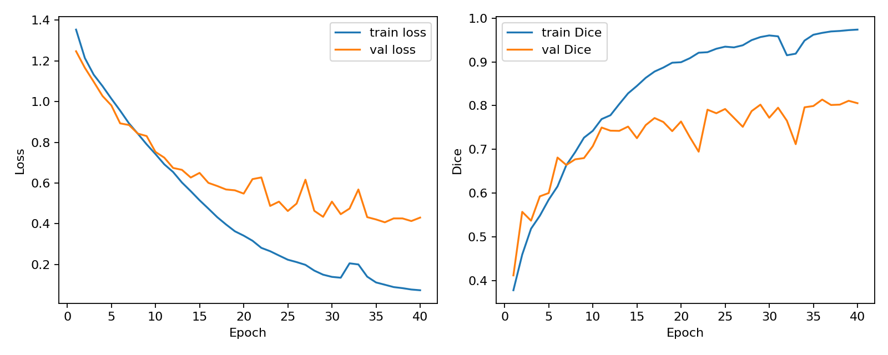
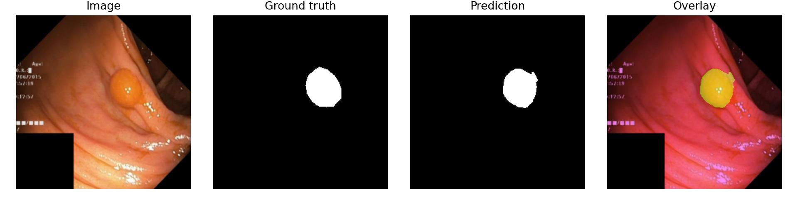

# 基于 Attention U-Net 的结肠镜息肉图像自动分割研究

## 摘要

本文面向结肠镜检查中的息肉区域自动定位问题，设计并实现了一种基于 Attention U-Net 的医学图像分割方法。实验使用公开 Kvasir-SEG 数据集，输入为结肠镜 RGB 图像，输出为息肉区域的像素级二值掩膜。方法采用编码器-解码器结构提取多尺度特征，并在跳跃连接中加入注意力门控机制，以增强模型对病灶区域的关注。模型使用 BCE 损失与 Dice 损失联合优化，并采用 Dice、IoU、Precision 和 Recall 评价分割性能。实验在 Google Colab T4 GPU 上完成，最终在验证集上取得 Dice 0.8139、IoU 0.7196、Precision 0.8686、Recall 0.8260 的结果，说明模型能够较准确地分割结肠镜图像中的息肉区域。

## 1. 研究背景与意义

结直肠癌是常见消化道恶性肿瘤之一，腺瘤性息肉等癌前病变的早期发现和切除能够降低疾病风险。结肠镜检查是发现息肉的重要手段，但人工观察容易受到操作者经验、疲劳和病灶形态差异的影响。利用深度学习对结肠镜图像中的息肉区域进行自动分割，可以为医生提供辅助定位信息，并为后续病灶大小测量、风险评估和临床决策支持提供基础。

## 2. 数据集

实验使用 Kvasir-SEG 公开数据集。该数据集包含 1000 张结肠镜息肉图像及对应的像素级标注掩膜，图像和掩膜分别存放在 `images` 与 `masks` 目录中。数据集下载地址为：<https://datasets.simula.no/kvasir-seg/>。

本项目不将原始数据提交到代码仓库，而是在文档中标明下载网址，并在 Colab 中通过脚本下载和解压。

## 3. 方法

### 3.1 数据预处理

图像统一缩放到 256 x 256。输入图像转换为 `[0, 1]` 范围内的浮点张量，掩膜转换为单通道二值张量。训练集和验证集按固定随机种子划分，验证集比例为 20%，保证实验可以复现。

### 3.2 模型结构

模型采用 Attention U-Net。编码器由多层卷积块和下采样组成，用于提取从局部纹理到高级语义的多尺度特征。解码器通过转置卷积逐步恢复空间分辨率。与普通 U-Net 不同，Attention U-Net 在跳跃连接处加入注意力门控，根据解码阶段的语义信息对编码器特征进行筛选，从而减少背景区域对分割结果的干扰。

### 3.3 损失函数

训练目标由 BCE 损失和 Dice 损失组成。BCE 损失关注像素级二分类，Dice 损失关注预测区域与真实区域的重叠程度。二者结合可以缓解前景区域较小导致的类别不平衡问题。

## 4. 实验设计

本地环境没有 GPU，因此仅用于 smoke test：生成少量模拟样本，训练 1 个 epoch，验证数据读取、模型前向传播、损失计算、指标计算和结果保存流程是否正确。正式实验在 Google Colab T4 GPU 环境完成，使用完整 Kvasir-SEG 数据集训练模型。正式训练参数为：输入尺寸 256 x 256，batch size 为 8，训练 40 个 epoch，优化器为 AdamW，学习率为 0.0001，权重衰减为 0.0001。为了避免 Colab 运行时重置导致结果丢失，训练输出被保存到 Google Drive，并同步复制回本地 `outputs/colab` 目录。

主要评价指标包括：

- Dice：衡量预测区域与真实区域的重叠程度。
- IoU：衡量预测区域和真实区域交并比。
- Precision：衡量预测为息肉区域的像素中有多少是真实息肉。
- Recall：衡量真实息肉区域中有多少被模型检测到。

## 5. 实验结果

正式训练后，`outputs/colab/history.csv` 保存每个 epoch 的训练和验证指标，`outputs/colab/metrics_val.json` 保存最终验证集指标，`outputs/colab/predictions` 保存可视化分割结果。

最终验证集指标如下：

| 指标 | 结果 |
| --- | ---: |
| Dice | 0.8139 |
| IoU | 0.7196 |
| Precision | 0.8686 |
| Recall | 0.8260 |

训练过程中，训练集 loss 持续下降，验证集 Dice 在中后期稳定在 0.8 左右。最佳验证 Dice 出现在第 36 个 epoch，说明模型已经学到较稳定的息肉区域表示，但后续训练中训练集 Dice 继续升高而验证集提升有限，存在一定过拟合趋势。

下图展示了一组验证样本的分割结果。可以看到，预测掩膜基本覆盖了真实息肉区域，边界位置与人工标注较接近，说明模型能够利用结肠镜图像中的颜色和形态特征定位病灶。

## 6. 结论

本文实现了一个基于 Attention U-Net 的结肠镜息肉分割系统。该方法能够从 RGB 结肠镜图像中预测息肉区域掩膜，在 Kvasir-SEG 验证集上取得 Dice 0.8139 和 IoU 0.7196，具备辅助医生定位病灶的应用价值。由于课程实验资源有限，本文使用 Colab GPU 进行训练，本地仅用于代码正确性验证。实验结果也显示，训练后期训练集指标明显高于验证集指标，说明仍有进一步改进空间。后续可以尝试更强的分割模型，如 U-Net++、DeepLabV3+ 或 Transformer 结构，并进一步比较数据增强、早停策略和不同损失函数对分割性能的影响。
